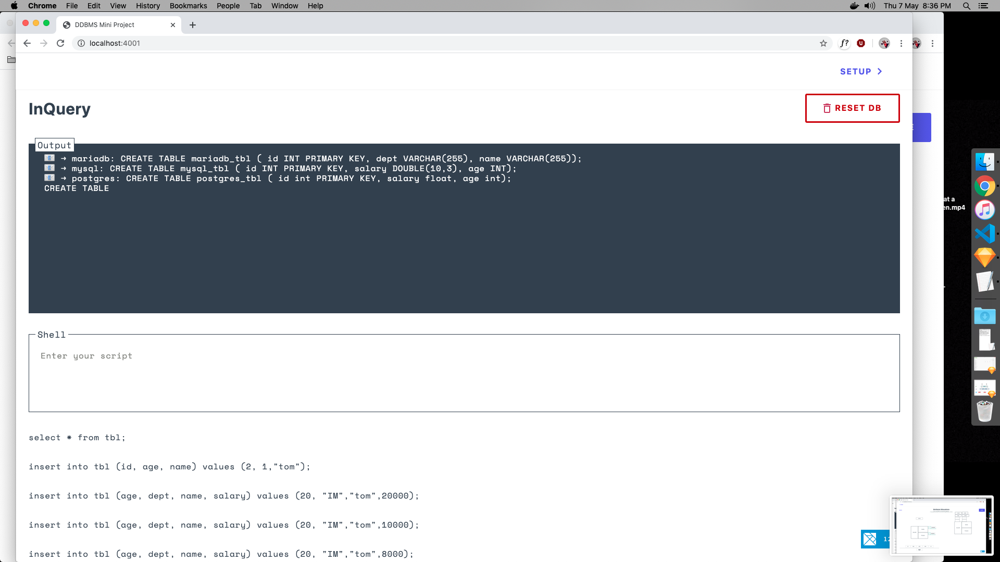

# DdbmsServer

## Requirements
  * Install Elixir and Phoenix (see Learn More below for more information)
  * Install Docker

To start your Phoenix server:

  * Install dependencies with `mix deps.get`
  * Create and migrate your database with `mix ecto.setup`
  * Install Node.js dependencies with `cd assets && npm install`
  * Start Phoenix endpoint with `mix phx.server`

Now you can visit [`localhost:4001`](http://localhost:4001) from your browser.

## Code Walkthrough

### Startup

When the backend is started with `mix phx.server`,  `/lib/ddbms_server/application.ex` is called and the `&start\2` method run. This calls the `&start_dbs\0` method which makes a system call to setup the databases based on the config in the `./docker-compose.yml` file. If you do not have the containers, it will pull them for you (which may take time...).

### Front end

At this point, you can setup the database by opening [`localhost:4001`](http://localhost:4001) and clicking on the Setup button on the top left.

### 1. Define schema


### 2. Define schema (filled)
.png)

### 3. Decide fragmentation


### 4. Allocate databases


### 4b. Allocate databases (done)
.png)


### 5. Allocate Attribute + Add Conditions


Click Done and the frontend lets the backend know what the configuration (the catalogue) is. A request is sent to `http://localhost:4001/api/setup` (found at `lib/ddbms_server_web/controllers/page_controller.ex`).

The request takes this format

```

 {
   "databases": [{
         "name": "mariadb"
     }, ...],
    "partitioning": [{
        "db": "mariadb",
        "fields": [{
            "name": "id",
            "fieldType": "PrimaryKey"
        }, {
            "name": "dept",
            "fieldType": "String"
        }, {
            "name": "name",
            "fieldType": "String"
        }],
        "conditions": {}
    }, ...],
    "all_fields": [{
        "name": "id",
         "fieldType": "PrimaryKey"
     }, ...],
     "primary_key": "id"
 }
```

### 6. Database sets up


The databases sets up. This can be seen at `/lib/ddbms_server/database_interface.ex`. It's a long file, so look for the line starting with `def handle_cast({:setup, parts},`

Note that at the end of the funtion, we return `{:noreply, Map.put(parts, "id", 1)}`. This creates a primary key which we will increment each time we insert into the database. We can't trust the individual databases to do it themselves and stay in sync.

Before clicking save, open a second browser window at `localhost:4001` in order to see the specific CREATE TABLE requests that are sent to each database. If you chose anything related to vertical fragmentation, you will see that the CREATE statements are different. Look at the line starting with `field_parts =` in the setup function to see how.


### 7. Start querying


Once the database is setup, return to `localhost:4001` to make queries.

Use the script textfield at the bottom to start making requests. 

* Only select and insert statements are allowed. 
* You can only insert when you provide all the fields except the primary key field ("whatever you choose that to be"). 

The code for this on the backend can be seen at `/lib/ddbms_server/database_interface.ex`.
It's a long file, so look for the line starting with `def handle_cast({:select,` and `def handle_cast({:insert,`

`Programming is just data and transformations on that data. Dave Thomas` 

We are using a lot of pipes to transform data in steps. 
Each time you see the pipe operator (`|>`), it means that we are taking the input from the previous function and inserting it into the next function as the first input. 

Welcome to functional programming! The goal is to chain many small and simple functions into complex programs(programming by composition)

If you are not sure about what a function does, you can add an (IO.inspect() function call before and after it)

Change this 
```
...
  |> transform1()
  |> transform2()
  |> transform3()
  |> ...
```

Into this
```
...
  |> transform1()
  |> IO.inspect(label: "before")
  |> transform2()
  |> IO.inspect(label: "after")
  |> transform3()
  |> ...
```

Comments for select and insert are in the code

## Learn more

  * Elixir: https://elixir-lang.org/getting-started/introduction.html
  * Phoenix: http://www.phoenixframework.org/
  * Elm: http://elm-lang.org/Get-Started.elm

